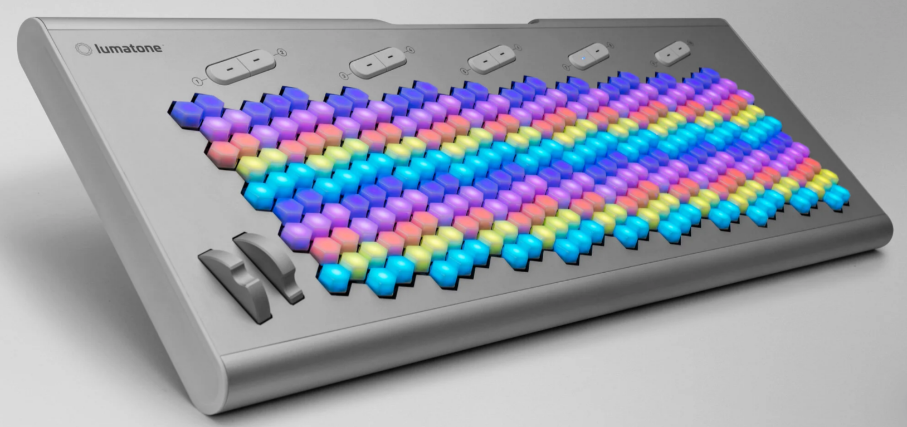

# TODO

Remember https://gemini.google.com/app/81c4b4fb40317cdf for parsing blog. Gemini stuck something in Google Keep.

code::DIRECTIVE is currently unused. May be useful when attaching << to directive.

Immediate parser rework:
* Add an attribute to a directive of whether it requires a data block, and if so, require the `<<` to follow the directive and know how to parse it.

Bugs
* Polyphony for csound doesn't work correctly when splitting parts to use simultaneous tunings. We need something else...perhaps polyphony groups that default to instrument or maybe that default to global but you can assign parts to polyphony groups along with instruments. Maybe csound_instrument takes an optional polyphony group parameter?

nerds.de loopbe1 -- windows virtual midi port

* CSound: interpret accents with envelope, then figure out what this does to articulation adjustment.
* Articulation adjustment directives:
  * four factors: default of each plus modifier for each option
    * default velocity (72)
    * accent velocity (96)
    * marcato velocity (108)
    * staccato shorten amount (1/4 beat)
  * Can be applied globally or at the part level
* MIDI:
  * generate tuning files for midi by port and channel
  * generate summaries of part -> track/port/channel, etc.
* Doc cleanup

Recommended timidity:
```
timidity -A100,100a
timidity -x "bank 0\n 0 %font \"/home/ejb/tmp/local/z/a.sf2\" amp=127 pan=0" --output-mono -A100,100a /tmp/a.midi
```

Note: not tested: > 127 tunings, > 16 channels, sound font banks, a few more minor cases; for MPE, more than 16 channels

Notes about mark/repeat for architectural docs. They are based on the timeline, not the token stream. This has both advantages and disadvantages.

* Disadvantages
  * All logic around resolving pending ties and dynamic changes have already been completed, which means a tie in effect at the end mark would already have been resolved to something after the repeat. This is okay except it complicates things like having a tie right before a repeat and a matching tie at the first ending. This can be handled in other ways, but it might be possible to make the logic more sophisticated. It might be possible to do dynamic/tie resolution and overlapping tempo detection as a post-processing step, which could give us a middle-ground between what is there now and making repeats lexical. This would create the need for additional timeline events, so we would probably want to create a parallel set of events and have `into_timeline` only return events that are intended for the generators. This may not be worth ever doing.
* Advantages
  * A repeated section gets to stay in whatever tuning it has.
  * There's never any question about whether something may be syntactically or semantically valid in a repeat. This is probably enough of an advantage to override the disadvantages.

It has to be understood that repeats are temporal repeats, not lexical repeats. If you think about it this way, the constraints are logical.

----------

Note somewhere that coverage should be 100% for pass*.rs, score.rs, model.rs, and timeline.rs as this ensures all error conditions are tested and that there are no unreachable code paths. Unreachable code paths would indicate that the parser isn't coded as tightly as it should be. These would arise if later code relies on earlier validations, which is fragile.

----------

Muse about printed notation hints. We could potentially generate MusicXML, LillyPond, or add enough metadata to the timeline JSON dump that someone could do their own notation from it.

----------

Oseh Shalom as possible JI demo piece: `1:g, c c b%, | 4:c | 1:g, b%, b%, a, | 4:b%, |` ...
Anything with modulations.

```
1:g  b% a% g 4:f
2:e%    e%   4:e%
2:c     c    4:c
2:~     b%,  4:a%,
```

Fuzz testing. A file that ends in the middle of a directive panics. The panic would have been clearer with context as well.

Finish doc so `syntoniq doc` gives more than just directives.

Current state:
* Next steps
  * Timeline
    * Backend order: JSON, MIDI, csound; target MTS instruments, use velocity for attack only, and play with either CC#7 or CC#11 or both for dynamics.
  * Work on reformatter
    * Should be able to work from token stream but only after validation has passed
  * Generate music via timeline
* Remaining syntax
  * tempo, accel, decel
  * morph, strum
  * define_instrument, use_instrument
  * marks, regions, repeats

Next, I would like create a timeline capable of expressing everything we have so far, perhaps taking it end to end through csound and midi. Then, as new features are added, they can be added end to end. This will make it easier to test new features and result in more incremental or less refactoring.

See
* ~/Downloads/MIDI Tuning Updated Specification.pdf
* ~/source/examples/rust/midi

Basic strategy: figure out total number of channels needed for 10 octaves of a scale, then track the number of simultaneous (instrument, scale, base_pitch) triples. This determines number of simultaneous channels, which in turn determines number of ports. Try to keep all channels for a part on the same port.

XXX Document highlight-next-span in a dev/test README -- can refer to comment in code

# Keyboard thoughts

Bake keyboard layouts into the code for now. A keyboard consists of a number of rows and a number of columns in each row for note keys. Rows are numbered from 1 top to bottom, and columns are numbered from left to right. For hex keyboards, rows lie along a specified direction, which could be the line formed by the smallest angle from horizontal that has directly adjacent keys (Lumatone below) or some angle offset from horizontal (e.g. HexBoard-60, which is at 60 degrees fro horizontal in portrait mode). The rows and columns are specified as an array of numbers indicating the number of columns in each row from top to bottom. An angled layout will provide rows of less uniform length but will also provide some longer rows.

See , [HexBoard](hexboard.jpg).

Layouts:
* Launchpad: 8, 8, 8, 8, 8, 8, 8, 8
* Hexboard: 9, 10, 9, 10, 9, 10, 9, 10, 9, 10, 9, 10, 9, 10
* Hexboard-60: 2, 4, 6, 8, 10, 12, 14, 14, 14, 13, 11, 9, 7, 5, 3, 1
* Lumatone: 2, 5, 8, 11, 14, 17, 20, 23, 26, 28, 26, 23, 20, 17, 14, 11, 8, 5, 2

With each cell as RC (Row, Col), this is the launchpad (noting that the actual launchpad uses note numbers that are a row inversion of this):

```
11 12 13 14 15 16 17 18
21 22 23 24 25 26 27 28
31 32 33 34 35 36 37 38
41 42 43 44 45 46 47 48
51 52 53 54 55 56 57 58
61 62 63 64 65 66 67 68
71 72 73 74 75 76 77 78
81 82 83 84 85 86 87 88
```

and this is the HexBoard (using rows A=1 to N=14 and columns A=1 to J=10):

```
  AA  AB  AC  AD  AE  AF  AG  AH  AI
BA  BB  BC  BD  BE  BF  BG  BH  BI  BJ
  CA  CB  CC  CD  CE  CF  CG  CH  CI
DA  DB  DC  DD  DE  DF  DG  DH  DI  DJ
  EA  EB  EC  ED  EE  EF  EG  EH  EI
FA  FB  FC  FD  FE  FF  FG  FH  FI  FJ
  GA  GB  GC  GD  GE  GF  GG  GH  GI
HA  HB  HC  HD  HE  HF  HG  HH  HI  HJ
  IA  IB  IC  ID  IE  IF  IG  IH  II
JA  JB  JC  JD  JE  JF  JG  JH  JI  JJ
  KA  KB  KC  KD  KE  KF  KG  KH  KI
LA  LB  LC  LD  LE  LF  LG  LH  LI  LJ
  MA  MB  MC  MD  ME  MF  MG  MH  MI
NA  NB  NC  ND  NE  NF  NG  NH  NI  NJ
```

A layout consists of a number of mappings placed onto the keyboard. A mapping maps positions to notes from the tuning for a specified part. A mapping can be manual or isomorphic. A manual mapping should have the same number of rows and columns. An isomorphic mapping is a regular directive. A manual mapping must be defined by a set of note placements within the mapping, which defines the mapping's size and layout. These are enclosed in `<< ... >>` delimiters (like scale blocks) and consist of space-separated notes on one line per row. You can use `~` to indicate a spot that should not have a note assigned, useful for positions that will be off the keyboard after placement. The parser can recognize whether something is a scale block or a manual mapping based on whether it follows `define_scale` or `define_manual_mapping`.

Here are examples:

```
use_scale(part="p1" scale="ji")
define_manual_mapping(
    mapping="m1"     ; mapping name
    part="p1"        ; part whose current tuning is used for notes and pitches
) <<
c# d% e% h11 f# a% h7 b%
c  d  e  f   g  a  b  c'
>>

use_scale(part="p2" name="17-EDO")
define_isomorphic_mapping(mapping="m2" part="p2" steps-h=3 steps-v=10)
```

To define a full keyboard layout, you specify a keyboard type and multiple mapping placements.

```
define_layout(keyboard="launchpad" layout="l1")
place_mapping(
   layout="l1"
   mapping="m1"
   first_row=n  ; first row on keyboard to allocate (default=1)
   first_col=n  ; first column on keyboard to allocate (default=1)
   num_rows=n   ; number of rows to allocate (default=all remaining)
   num_cols=n   ; number of columns to allocate (default=all remaining)
   anchor_row=n anchor_col=n  ; see below
)
```

The `anchor_row` and `anchor_col` parameters are interpreted differently for isomorphic and manual mappings. In both cases, they may be negative or larger than the number of rows and columns. For isomorphic, they represent the position of the base pitch. For manual, they indicate the position of the lower-left note.

If the placement parameters result in overlapping mappings or mappings that fall off the edge, later ones overwrite earlier ones. This makes it easier to deal with non-rectangular keyboards. For example, hexagonal-key keyboards will not usually have the same number of columns in every row. This gives us a best-effort way to place keys, which is especially useful for repeating mappings where the allocated rows/cols is larger than the number of notes mapped. That gives us the ability to fit as much of the mapping as possible and use extra space for repeating notes as they fit. When manual maps are repeated, they repeat up by one cycle size to the right and also up.

Examples

```
; Fill the whole keyboard with 19-EDO, 3 steps horizontally, 8 steps up-right.
define_layout(keyboard="hexboard" layout="19-EDO-h3v8")
use_scale(scale="19-EDO" part="p1")
define_isomorphic_mapping(mapping="19-EDO-h3v8" part="p1" steps-h=3 steps-v=8)
place_mapping(layout="19-EDO-h3v8" mapping="19-EDO-h3v8" anchor_row=8 anchor_col=5)

; Fill the top half of the keyboard with 17-EDO and the bottom four rows with JI
define_layout(keyboard="hexboard" layout="17-EDO-JI")
; Use m1 (ji) and m2 (17-EDO) from above
place_mapping(
    layout="17-EDO-JI" mapping="m1" ; JI
    first_row=11 ; last 4 rows
    first_col=1
    anchor_row=4 anchor_col=1
)
place_mapping(
    layout="17-EDO-JI" mapping="m1" ; JI
    first_row=1 num_rows=10
    anchor_row=5 anchor_col=4
)
```

## Timeline

Score parser should generate a timeline that is fully ready for generating various types of output. That's where the responsibility of the parsing module in the common crate should end.

The timeline should contain enough information to generate csound, midi, and some kind of JSON dump that we can use for testing and debugging. Things in the timeline:

* Header: source file
* Timeline event:
 * span of triggering event in source
 * offset in ticks
 * metadata
 * similar to MIDI tracks, we have a global timeline with things like tempo and a timeline for each part
 * also global section for tunings and instruments
 * sorted by time, then span
* Tuning
 * Need to capture the chain of tunings for the base pitch so we can have a comment like `17-EDO, up ^2|19 from 'e' from default` or show the base pitch as `220*^1|4*^1|3*^2^19` or both.
 * Pitches should be shown in comments factor from base pitch, e.g. `*9/8` or `*^2|19`
 * Perhaps have a catalog of unique tunings, perhaps in order of appearance, and set a tuning based on that to reduce duplication and make it easier to generate tuning files. If we keep a uuid from an atomic counter on tune generation, this becomes easy; we just have to keep the predecessor's ID when `base_factor` or `base_note` is used.
* Notes
 * organized by part
 * name
 * pitch as
   * factor of base
   * Hz
   * scale degree with zero as base pitch and pitches sorted numerically +/- cycle. If we allow pitches lower than the base pitch, I think it's okay. The base pitch still gets zero. So if you had a scale like `<< ^-1|3 q | 1 r | ^1|3 s >>`, then `q` would be -1, `r` would be 0, and `s` would be 1. Then `q'` would be 2, and `s,` would be -2. This can be used to map to midi note numbers
 * on|off + "velocity"
 * other details attached to the note
* Dynamics -- need a way to represent crescendo, decrescendo
* Instrument assignment, metadata changes (strum, morph)
* Comments from source are not preserved here but are preserved by the reformatter

End goal: output generators should be able to go straight to output without encountering any error conditions.

Example:
* Csound: can create a separate instrument for each source instrument or maybe for each part if we can share csound instruments easily. Our instruments have to support certain things...will have to design that part, but that can likely be done after generating the timeline.
* MIDI: can allocate tracks and channels based on number of simultaneous notes, instruments, etc.
* Dump/Json: just serialize the timeline

# Syntoniq DSL

The goal is to create an ASCII/UTF-8 file format for describing music with arbitrary tuning systems.

Goals:
* Use a score-like layout with the ability to automatically align notes and check for synchronization across parts and monophonic voices ("notes") within a part
* Represent any scale, pitch, or tuning using my pitch representation with support for chaining
* Represent notes, chords, rhythms, and dynamics with good granularity
* Support strumming and morphing
* Support multiple parts and multiple voices per part
* Generate
  * Live csound playback including with selected regions or voices
  * csound files
  * some kind of MIDI; research required; see below.
* Represent time signatures or bar numbers as optional

Possible goals:
* Use scala files

Non-goals:
* Generate printed scores
* Be opinionated about any particular system of notation
* Produce fully nuanced, performance-ready files -- if you want that, use a MIDI target and do further work in a DAW
* Drums, at least for now

# Broad Terminology

* *Part*: something akin to a score line, e.g., an instrument, one staff of a piano score, etc. At a any given time, a part may be assigned a single tuning, instrument, and dynamic, and there are other part-specific properties like strum rate. These can be inherited from global properties but may not be overridden at the note level.
* *Note*: a single rendered pitch. Chords are represented as multiple notes within a part. You can think of a note as a single, monophonic sound within a part.

A note about the word *voice*: I previously used *voice* to refer to what I now call *part*, but I abandoned this terminology because a part may be polyphonic, and it is useful to be able to use the word "voice" to refer to a single monophonic voice within a part. The word "voice" no longer refers to a semantic or syntactic element within the DSL.

# MIDI thoughts

See ~/Q/tasks/reference/midi.md

General strategy:
* Generate a separate track per part
* Bulk load MTS non-real-time at time 0 in the track for the initial scale; send real-time bulk reload if the scale changes. If morphing, use pitch bend before switching, then clear pitch bend. Note that morphing from one tuning to another can be supported by the synth, so whether or not to try to morph manually might be a configuration option.
* Assume separate routing per track
  * If we use non-overlapping channels AND all tracks using the same tuning for the whole time, then our output would work with all tracks routed to the same output; maybe make this an option? This would also make it possible to use timidity. Perhaps the option would be to generate a separate MIDI file for each group of tracks that have to be routed separately. In that case, if all tracks had the same tuning and didn't require a total of more than 15 channels (excluding 10 for percussion -- no reason to avoid channel 0), the whole thing could go to a single MIDI file which could be played with timidity.

DAW usage:
* If > 16 separate tracks, generate multiple MIDI files
* Within each MIDI file, assume each track has to be routed separately (but see above)
* Load MIDI file, route tracks, edit as needed


MIDI volume: CC#7 is channel volume, CC#11 is channel expressiveness, often interpreted as a percentage of volume, and then there's note-level velocity and channel and polyphonic (note-level) after-touch. Polyphonic after-touch is often unsupported. The list below is a summary from an AI chat of how I could represent dynamics in MIDI:

* Encode part-level dynamics as CC#7 (Channel Volume) on every MIDI channel used by that part (send before first note and on changes). This gives DAW users a clear, editable track-level automation lane.
* Use a neutral baseline note velocity for every note (configurable default). 72 (decimal) is a fine sensible default.
* Encode accents by increasing per-note velocity above the baseline. Reasonable defaults: baseline = 72, simple accent = 96, strong accent (marcato/sfz) = 108. Make these configurable.
* Optionally also emit CC#11 Expression if you want a finer control layer (but it’s optional and not universally honored).
* To make files immediately playable in sample-based synths (fluidsynth, timidity), you may want to map major written dynamics to both CC#7 (for DAW automation) and scaled velocities (for sample-layer selection), or at least ensure velocity accents are present. Many SF2 instruments rely on velocity for sample selection/attack.

I will probably want configurable defaults for
* Whether to use CC7, velocity, or both for dynamics
* How to map accents to velocity

Project: write/find something for working with MIDI files and figure out what works well as input for timidity and also Reaper. See whether other things like Ardour or Surge can work with these. Validate all of the above assumptions.

# Syntax

## Basic Syntactic Rules

Leading whitespace is stripped. Any remark about what a line starts with refers to after any leading whitespace.

The comment character is `;`. Everything from `;` to the end of the is a comment.

Comments are allowed in most places. There are a few exceptions:
* Inside multi-line directives, comments are allowed after the initial `(` and after each parameter, but comments on their own lines are errors.
* Inside multi-line scale blocks, comments are allowed after the initial `<<` and at the end of each line, but comments on their own lines are errors.

Blank lines are ignored except when they terminate score blocks.

A file consists of a sequence of the following, excluding comments and non-functional blank lines:

* Directives: declarative statements that look like function calls
* Score blocks: a sequence of one or more lines, each starting with `[part]` or `[part.note]`. Score blocks are ended by blank lines or things that are not comments, dynamic lines, or note lines.
* Scale definitions, described below

## Directives

* `name(k=v k=v ...)`
* may be divided across lines
  ```
  name(
    k=v
    k=v
  )
  ```
* a keyword may be repeated, e.g. `use_scale(scale="default" part="p1" part="p2")`
* multiple may occur on one line
* comments allowed after `(` and on the same line as a parameter but not on lines between parameters

Parameters can have one of these types:
* Pitch: the pitch notation
* Number: an integer, rational, or fixed-point decimal
* String: a double-quoted string with `\` as a quoting character only for `\"` and `\\`

## Score Blocks

A score block consists of one or more note lines and zero or more dynamic lines. A note line starts with `[part.n]`, and a dynamic line starts with `[part]`. This is defined further below.

## Scales

The `define_scale` directive is followed by scale definition blocks.
```
define_scale(scale=... base_pitch=... cycle_ratio=...)
```
* `name` is mandatory
* `base_pitch` defaults to `220*^1|4` (middle C based on 440 Hz, 12-TET)
* `cycle_ratio` defaults to `2` (octave)

An scale definition block has the format
```
<<
pitch-factor name name name
pitch-factor name name name
...
>>
```

or
```
<< pitch-factor name name | pitch-factor name name >>
```

The names are enharmonic names for the scale degree. Examples:
```
define_scale(scale="19-EDO")
<<
 ^0|19 c |  ^1|19 c# d%% |  ^2|19 d% c##
 ^3|19 d |  ^4|19 d# e%% |  ^5|19 e% d##
 ^6|19 e |  ^7|19 e# f%
 ^8|19 f |  ^9|19 f# g%% | ^10|19 g% f##
^11|19 g | ^12|19 g# a%% | ^13|19 a% g##
^14|19 a | ^15|19 a# b%% | ^16|19 b% a##
^17|19 b | ^18|19 b# c%
>>

define_scale(scale="11-JI-partial")
<<
1     c
17/16 c#
9/8   d
6/5   e%
5/4   e
4/3   f
11/8  h11    ; 11th harmonic
45/32 f#-d   ; major third above d
17/12 f#-c#  ; fourth above c#
3/2   g
8/5   a%
5/3   a
7/4   h7     ; 7th harmonic
16/9  b%
15/8  b
>>
```

I had considered having a special "equal division" scale type and using an index instead of a pitch factor, but allowing `0` to be used creates a lot of parsing headache, and the only thing different about EDO scales is that you can note shift them. But we don't have to disallow note shift for non-EDO scales, so there's no reason to have the distinction.

## Notes

```
note ::= [$beats:]$note_name[$octave][(mods)][~|>]
note_name ::= <see below>
octave ::= `'`[n] | `,`[n]
beats ::= rational-or-decimal
```

If `beats` is omitted, take from the previous note on the same line. It is mandatory for the first note on the line. Note that these are beats as in with csound, not LilyPond-style note durations. 2:c is twice as long as 1:c, and quarter-note triplets would have 2/3 beats each.

Beats may be `a`, `a/b`, or `a.b`.

If a note ends with `~`, it is not turned off at the end of its duration. This can be used to implement ties when a pitch is held for a long time. If a note ends with `>`, it means its pitch should slide to the next pitch; see morphing below.

The note `~` by itself does nothing, making useful as a rest, continuation of a tied note, or way to position a dynamic.

Modifiers can potentially be used for accents or length modifiers. We could support `>` and `^` for accents and `.` and `_` for legato, though it's not entirely clear what these would do. Maybe I can have a parameter that sets space between notes that can be locally modified with `.` and `_`. Probably not in the first iteration.

The `|` symbol by itself may be used as an alignment check. It doesn't have to match a bar line in the traditional sense as there is no enforced time signature. (TODO: consider whether there should be a time signature that forces bar checks to align with bar lines.)

Pitches are absolute (possibly transposed). No relative octaves.

Note names must start with a letter and may contain any alphanumeric character or any of the following: `_*^/.|+-!#%&`. The broad alphabet for note names allows various symbols to be used as accidentals and also allows ratios and pitch notation to be embedded in note names. We avoid any of `()~:=<>@,';` to avoid syntactic ambiguity.

I would like to be able to morph smoothly from one pitch to another, e.g., to implement a glissando. Ideally, it should be possible to notate Fabio Costa's Etude on Minor Thirds as well as Elegy Waltz in EDO-17. I plan to use parts of these for demonstration purposes if I can get permission. See morhping and strumming below.

By convention, these ASCII symbols are used for accidentals.

* # = ♯ (diatonic sharp)
* % = ♭ (diatonic flat)
* + = ↑ (single scale step up)
* - = ↓ (single scale step down)

The default scale is 12-EDO with note names c, c#|d%, d, d#|e%, ... It is called `default`.

Examples:
* `c` -- play middle C (C4) for a single beat
* `3:e'~` -- play E5 for 3 beats and then leave the note on
* `2:~ g` -- wait 2 beats, resting or sustaining as appropriate, then play G4 for two beats.

## Dynamics

* Expressed as a numerical value from 0 to 127 (for consistency with MIDI), where `0` is silent.
* `dynamic@beat`
* `n` -- set the volume immediately to `n`
* `n<` -- start a crescendo; the next dynamic must be more than `n`. Volume is linearly interpolated.with m < n
* `n>` -- start a decrescendo; treated like a crescendo, but the next dynamic must be lower.
* Default volume is 72.
* The `<` or `>` is the last character.

Can only be expressed at the part level.

## Parts

A part maps (approximately) to a track for MIDI and an instrument for csound. In some cases, a part may have to be represented by more than one MIDI track, and it may often be possible to use the same csound instrument for more than one part.

# Version

The first directive must be `syntoniq(version=n)`. This is a file format version, not a software/semantic version. It increments whenever there is a non-backward compatible change. The contract is that you should always use the latest software that supports version `n` since operations, optional operation named parameters, or other syntactical changes that would have been errors in an older version are permitted without incrementing `n`.

# Tuning

Tuning
```
use_scale(scale="..." part="...")
set_base_pitch(absolute=... relative=... part=...)
transpose(written="..." pitch_from="..." part=...)
reset_tuning(part=...)
```
* Default tuning is 12-EDO with the base pitch of `220*1|4`
* For set_base_pitch, exactly one of `absolute` or `relative` is required.
* `absolute` sets the base pitch of the scale to an absolute pitch
* `relative` sets the base pitch by adjusting relative to the current base pitch
* Transpose transposes the tuning so that the note named by `written` will have the pitch previously assigned to the note named in `pitch_from`.
  * `transpose(written="d" pitch_from=c")` would transpose down a whole step in 12-EDO.
* When no parts are specified, this sets the default tuning. If one or more parts are specified, it sets the tuning for the specified parts.
* `reset_tuning`: with no parts, resets all tunings. With parts, it resets each part's tuning to use the default tuning. There is no way to reset the default tuning without clearing the tuning table. If you need it, `tune(scale="default")` will do it.

Examples:
```
transpose(written="c" pitch_from="3")
use_scale(scale="17-EDO")
set_base_pitch(relative="*2|17")
set_base_pitch(absolute=264 part="p1")
```

# Tempo

Tempo changes are global and can be delayed relative to the current beat wherever they appear in the score.

Set the tempo to 60 beats per minute starting 2.5 beats after the current moment:
```
tempo(bpm=60 when=2.5)
```

Accelerate linearly, starting immediately from 60 to 90 beats per minute over the next 8 beats:
```
accel(start=60 end=90 for=8)
```

Decelerate linearly, starting in two beats from 90 to 60 beats per minute over 4 beats:
```
decel(start=90 end=60 when=2 for=4)
```

# Examples

The opening two bars of my rainbow medley with each part as a separate part. Note the use of the bar check and the alignment, which is optional and can be automated. There is an implicit bar check at the end of each line. If a bar check appears on any line, it must appear on all lines. For dynamics, the bar check just serves as the anchor point for beat offsets.

```
[p1] 1/2:e g e g e g e   g |   f g     f g   f g    f  g
[p2]   1:d   c   d   c     |   e   1/2:d e   d e    d  e
[p3]   2:~     1:b,  b%,   | 2:c             b,
[p4]   4:~                 | 2:~             a,
[p5]   4:~                 | 2:a,          1:g, 1/2:f, e,
```

The same thing but with a single part containing more than one note per part with a dynamic swell:

```
[p1.0]  1/2:e g e g e g e   g |      f g     f g   f g    f  g
[p1.1]    1:d   c   d   c     |      e   1/2:d e   d e    d  e
[p1.2]    2:~     1:b,  b%,   |    2:c             b,
[p1.3]    4:~                 |    2:~             a,
[p1.4]    4:~                 |    2:a,          1:g, 1/2:f, e,
  [p1]   64@0    64@2<        |   96@0>         64@2
```

It would be nice to have tool support for alignment. Within a score block, align notes so the beginning of the pitch part of notes or the location part of dynamics are aligned rhythmically after any beat markers as in the above examples. See below for an algorithm.

The DSL interpreter should have some commands to check and align. I could run C-c C-f on a score line, and it could either reformat or generate output with embedded comments containing any error messages. No reason to integrate with flycheck, etc.

Other notes:
* If there are bar checks, this algorithm can be applied to each "bar" and spaces can be added before the bar checks to force the bar checks to align.
* To align, calculate total number of discrete ticks (GCD of duration denominators * total beats)
* For each note, get number of characters before and after alignment point; `:`, `@` count as before since some notes won't have an explicit mark
* prepend/append space so all notes are the same width and have the alignment point in the same spot
* prepend each note with one extra space
* place notes based on numerator of n/GCD
* shrink vertical columns of spaces to width of 1
* align `]` of part names, prepending leading space

Example:

```
[treble] 1:e a 2/3:g f d
[bass] 2:c, 1:f, g,
```
* max characters before alignment marker = 4 (`2/3:`)
* max after alignment marker = 2 (`c,`)
* combined width = 4 + 2 = 6
* total beats = 4
* gcd of denominators = 3
* discrete ticks = 12. Each beat is 3 ticks.
* each note width, including leading space, is 7 (1+2+6)
* beat marker goes at position 4 (from 0)
* spaces except separator space shown below as `_`

Step 1: place each padded note based on its start position

```
|0     |1     |2     |3     |4     |5     |6     |7     |8     |9     |10    |11
 __1:e_               ____a_               2/3:g_        ____f_        ____d_
 __2:c,                                    __1:f_               ____g,
```

Step 2: shrink space columns
```
 1:e  a 2/3:g f   d
 2:c,     1:f  g,
```

Step 3: prepend `]`-aligned part names:
```
[treble] 1:e  a 2/3:g f   d
  [bass] 2:c,     1:f  g,
```

# Morphing

One way to support morphing might be to allow a note to start or end with `>`, e.g.
```
[p1] 1:c> >e
```
If this is done, we probably need a morph directive, like `morph(before=1/8 after=0 when=2)`, indicating to start the morph 1/8 of a beat before the note change and end exactly at the new note, effective 2 beats after the current moment. This makes it similar to accel/decel.

# Strumming

To indicate strumming, we can use something like `strum(gap=beats on_beat=n)` where `n` is a note number, and notes are strummed in order. For example:
```
  [p1] strum(gap=1/12 on_beat=0)
[p1.0] 1:c
[p1.1] 1:e
[p1.2] 1:g
```
would strum a C major chord with the `c` on the beat and the `e` and `g` following 1/12 and 2/12 of a beat later.
```
  [p1] strum(gap=1/12 on_beat=2)
[p1.0] 1:c
[p1.1] 1:e
[p1.2] 1:g
```
would be similar but the strumming would start before the beat with the `g` on the beat.

Consider how to handle strumming that precedes the first beat. Maybe make it an error and require a rest? That way, we can generate better metadata about marks or file positions and their time offsets in the output.

# Metadata

Key signature and time signature are not needed for this application, but time signature can be helpful for MIDI piano rolls or notation. Key signature can be useful for notation as well, but it's not really useful with microtonal music. It would be useful to provide mechanisms to output this information into the MIDI file even if it is not otherwise use. We can also include ways to include creator and title. Looking at a `midicsv` file as generated by Lilypond or other applications can provide a useful template.

# Instruments

If we support midi and csound, we need different ways to represent instruments. It should be general so additional backends could be added.

```
define_instrument(name=... midi=... csound=...)
use_instrument(name=... part=...) ; default or within a part
```
* name: generic
* midi: program/instrument number
* csound: instrument number or name

# Marks, Regions, and Repeats

```
mark(label="x")
repeat(start="mark1" end="mark2")
```

It would be useful to be able to play from a mark to another mark, probably just as command-line arguments (`--start-at-mark`, `--end-at-mark`, `--skip-repeats`). We can maintain full state so notes that are still on are playing, etc.

It would be useful to be able to generate data about time and/or beat offsets for lines and marks.

# Software Design

Follow comments in the code, starting from parsing.rs.

Directives are defined using a derive macro that generates help from doc comments.

For csound, we should design some kind of instrument template that allows dynamic volume change, but changes to instruments can just be a part to instrument mapping change in the software. For MIDI, we will have to maintain some kind of track/channel mappings, but it shouldn't be very hard. Probably the rule should be to put as many notes as possible in one channel, moving out to additional channels if we have differences in channel-specific settings like volume or pitch bend.

Everything should have simple defaults. The following should be a valid file:
```
syntoniq(version=1)
[p1.0] 1:c
```

Defaults:
* tempo: 60 bpm
* instrument: csound instrument 1, MIDI program 0
* tuning: 12-EDO (from C), base pitch = `220*1|4`

Write a tree-sitter grammar and an LSP server. See this chat: https://gemini.google.com/app/665ad5eb23ae0417

Summary:
* LSP Server crates:
  * lsp-server: This is the core engine. It handles the low-level JSON-RPC communication protocol over stdin/stdout and provides a simple event loop for receiving messages from the editor.
  * lsp-types: This crate contains all the Rust structs and enums that correspond directly to the Language Server Protocol specification (e.g., Diagnostic, CompletionItem, Position). It saves you from defining these data structures yourself.
* Tree-sitter Grammar Reference
  * Tree-sitter uses a static grammar definition; it is a library that editors use directly, not a server with a protocol.
  * The core of your work will be creating a grammar.js file. This single file defines your language's syntax using a JavaScript DSL. The Tree-sitter CLI tool then uses this file to generate a C parser (parser.c), which gets compiled into a shared library that editors can load.
  * The best reference for getting started is the official Tree-sitter documentation: [Creating Parsers](https://tree-sitter.github.io/tree-sitter/creating-parsers)

## Reformatting

The reformatter will first fully validate an input file. Then it will drive the formatting from pass1 tokens, peeking at later parsing results for semantic information as needed.

Suggested reformatting rules:
* Collapse multiple blank lines to single blank lines, and remove leading and trailing blank lines
* Remove trailing white space
* In a multi-line structure (score block, scale definition block, multiline directive), keep comments aligned and offset by two spaces from the longest line
* Remove spaces from around `=` in directive parameters
* If a directive with any trailing comment exceeds 100 columns, move the trailing comment to the preceding line. If still over 100 columns, break the directive to one parameter per line.
* If a directive that contains no parameter-level comments fits on one line in <= 100 columns, reformat as a single line. Never move a preceding comment to after a single-line directive.
* Apply alignment to score blocks as above
* Within scale definition blocks, right-justify pitches or indices with columns, then align and left-justify note names

## Considerations

A scale like 31-EDO will overflow 128 notes. It doesn't matter for csound. For MIDI, can we should automatically split the tracks.
